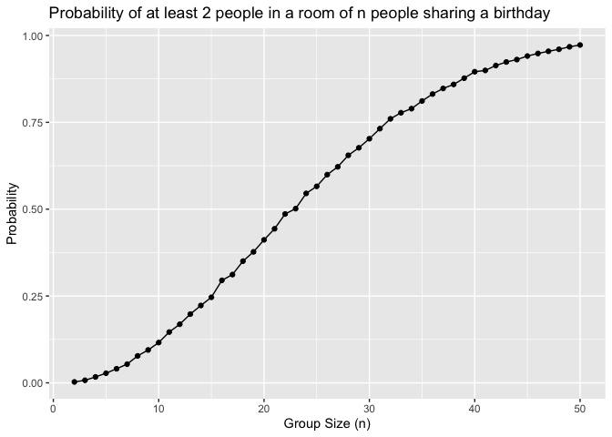
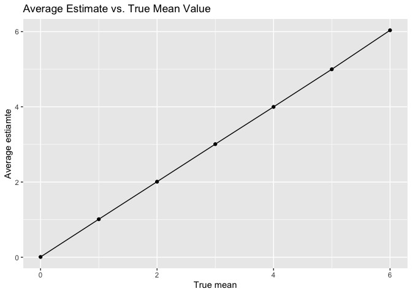
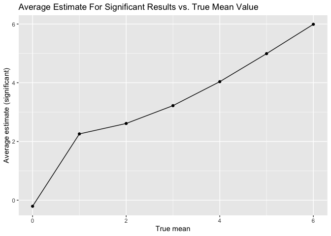
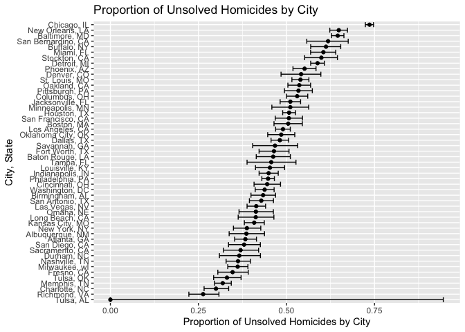

p8105_hw5_ars2376
================
2025-11-12

``` r
library(tidyverse)
library(rvest)
library(ggplot2)
```

## Problem 1

Creating the function to get the probability at at least two people in a
room of `n` people share a birthday

``` r
bday_sim = function(n_room) {
  
  birthdays = sample(1:365, n_room, replace = TRUE) 
  
  repeated_bday = length(unique(birthdays)) < n_room
  
  repeated_bday
}
```

Run this function 10000 times for each group size between 2 and 50

``` r
bday_results =
  expand_grid(
    bdays = 2:50, 
    iter = 1:10000
  ) |> 
  rowwise() |> 
  mutate(
    result = bday_sim(bdays)
  ) |> 
  ungroup() |> 
  group_by(bdays) |> 
  summarize(
    prob_repeat = mean(result)
  )
```

Plot showing probability as a function of group size

``` r
bday_results |> 
  ggplot(aes(x = bdays, y = prob_repeat)) +
  geom_point() +
  geom_line() +
  labs(
    title = "Probability of at least 2 people in a room of n people sharing a birthday",
      x = "Group Size (n)",
    y = "Probability"
  )
```

<!-- -->

As shown by the plot, the probability of at least two people sharing a
birthday increases as the group size increases. When n = 23, the
probability of at least two people sharing a birthday passes 50%.

## Problem 2

``` r
sim_results =
  expand_grid(
    mu = 0:6,
    iter = 1:5000) |> 
  mutate(
    data = map(mu, ~rnorm(30, mean = .x, sd = 5)),
    test_result = map(data, ~t.test(.x, mu = 0)),
    tidy_result = map(test_result, broom::tidy)
  ) |> 
  unnest(tidy_result) |> 
  select(mu, estimate, p.value)
```

Getting power results

``` r
power_results =
  sim_results |> 
  group_by(mu) |> 
  summarize(power = mean(p.value < 0.05))
```

Plot showing proportion of times the null was rejected

``` r
power_results |> ggplot(aes(mu, power)) +
  geom_point() +
  geom_line() +
  labs(
    title = "Power of One-Sample T-Test vs. True Mean Value",
    x = "True mean",
    y = "Power of the test"
  )
```

<!-- --> As
the effect size, or true mean, increases, the statistical power
significantly increases. When the effect size reaches 4, the power
approaches 1. This shows that as effect size increases, the ability to
correctly detect a true effect increases as well, especially among
bigger effects.

Plot showing average estimate mean vs true mean

``` r
mu_est =
  sim_results |> 
  group_by(mu) |> 
  summarize(mean_est = mean(estimate))
```

``` r
mu_est |> 
  ggplot(aes(mu, mean_est)) +
  geom_point() +
  geom_line() +
  labs(
    title = "Average Estimate vs. True Mean Value",
    x = "True mean",
    y = "Average estiamte"
  )
```

<!-- -->

Plot showing average estimate of samples where null was rejected vs true
mean

``` r
mu_est_sig =
  sim_results |> 
  filter(p.value < .05) |> 
  group_by(mu) |> 
  summarize(mu_est_sig = mean(estimate))
```

``` r
mu_est_sig |> 
  ggplot(aes(mu, mu_est_sig)) +
  geom_point() +
  geom_line() +
  labs(
    title = "Average Estimate For Significant Results vs. True Mean Value",
    x = "True mean",
    y = "Average estimate (significant)"
  )
```

<!-- -->

The sample average estimate across tests for which the null is rejected
does not equal the true mean. This is due to selection bias. While the
first plot depicting the overall average estimate matches the true mean,
the second plot depicting the average estimate among significant results
is biased upwards for small true effects.

## Problem 3

``` r
homicides_df = 
  read_csv("homicide-data.csv")
```

    ## Rows: 52179 Columns: 12
    ## ── Column specification ────────────────────────────────────────────────────────
    ## Delimiter: ","
    ## chr (9): uid, victim_last, victim_first, victim_race, victim_age, victim_sex...
    ## dbl (3): reported_date, lat, lon
    ## 
    ## ℹ Use `spec()` to retrieve the full column specification for this data.
    ## ℹ Specify the column types or set `show_col_types = FALSE` to quiet this message.

The created `homicides_df` has 12 variables with key variables
being`reported_date` or the date of the homicide, the victim’s
`first_name` and `last_name`, `victim_race`, `victim_age`, `victim_sex`,
`city`, `state`, `lat` and `long` of the homicide, and `disposition` of
the case. There are 52179 observations in the dataset.

``` r
homicides_df = homicides_df |> 
  mutate(city_state = paste(city, state, sep = ", "))
```

Summarize within cities the total number of homicides and unsolved
homicides

``` r
total_homicides = homicides_df |> 
  group_by(city_state) |> 
  summarize(
    total = n()
  )

knitr::kable(total_homicides, col.names = c("City, State", "Total Homicides"))
```

| City, State        | Total Homicides |
|:-------------------|----------------:|
| Albuquerque, NM    |             378 |
| Atlanta, GA        |             973 |
| Baltimore, MD      |            2827 |
| Baton Rouge, LA    |             424 |
| Birmingham, AL     |             800 |
| Boston, MA         |             614 |
| Buffalo, NY        |             521 |
| Charlotte, NC      |             687 |
| Chicago, IL        |            5535 |
| Cincinnati, OH     |             694 |
| Columbus, OH       |            1084 |
| Dallas, TX         |            1567 |
| Denver, CO         |             312 |
| Detroit, MI        |            2519 |
| Durham, NC         |             276 |
| Fort Worth, TX     |             549 |
| Fresno, CA         |             487 |
| Houston, TX        |            2942 |
| Indianapolis, IN   |            1322 |
| Jacksonville, FL   |            1168 |
| Kansas City, MO    |            1190 |
| Las Vegas, NV      |            1381 |
| Long Beach, CA     |             378 |
| Los Angeles, CA    |            2257 |
| Louisville, KY     |             576 |
| Memphis, TN        |            1514 |
| Miami, FL          |             744 |
| Milwaukee, wI      |            1115 |
| Minneapolis, MN    |             366 |
| Nashville, TN      |             767 |
| New Orleans, LA    |            1434 |
| New York, NY       |             627 |
| Oakland, CA        |             947 |
| Oklahoma City, OK  |             672 |
| Omaha, NE          |             409 |
| Philadelphia, PA   |            3037 |
| Phoenix, AZ        |             914 |
| Pittsburgh, PA     |             631 |
| Richmond, VA       |             429 |
| Sacramento, CA     |             376 |
| San Antonio, TX    |             833 |
| San Bernardino, CA |             275 |
| San Diego, CA      |             461 |
| San Francisco, CA  |             663 |
| Savannah, GA       |             246 |
| St. Louis, MO      |            1677 |
| Stockton, CA       |             444 |
| Tampa, FL          |             208 |
| Tulsa, AL          |               1 |
| Tulsa, OK          |             583 |
| Washington, DC     |            1345 |

``` r
unsolved = homicides_df |>
  group_by(city_state) |> 
  mutate(
    unsolved = disposition %in% c("Closed without arrest", "Open/No arrest") 
  ) |> 
  summarize(
    unsolved = sum(unsolved),
    .groups = "drop"
  )

knitr::kable(unsolved, col.names = c("City, State", "Total Unsolved Homicides"))
```

| City, State        | Total Unsolved Homicides |
|:-------------------|-------------------------:|
| Albuquerque, NM    |                      146 |
| Atlanta, GA        |                      373 |
| Baltimore, MD      |                     1825 |
| Baton Rouge, LA    |                      196 |
| Birmingham, AL     |                      347 |
| Boston, MA         |                      310 |
| Buffalo, NY        |                      319 |
| Charlotte, NC      |                      206 |
| Chicago, IL        |                     4073 |
| Cincinnati, OH     |                      309 |
| Columbus, OH       |                      575 |
| Dallas, TX         |                      754 |
| Denver, CO         |                      169 |
| Detroit, MI        |                     1482 |
| Durham, NC         |                      101 |
| Fort Worth, TX     |                      255 |
| Fresno, CA         |                      169 |
| Houston, TX        |                     1493 |
| Indianapolis, IN   |                      594 |
| Jacksonville, FL   |                      597 |
| Kansas City, MO    |                      486 |
| Las Vegas, NV      |                      572 |
| Long Beach, CA     |                      156 |
| Los Angeles, CA    |                     1106 |
| Louisville, KY     |                      261 |
| Memphis, TN        |                      483 |
| Miami, FL          |                      450 |
| Milwaukee, wI      |                      403 |
| Minneapolis, MN    |                      187 |
| Nashville, TN      |                      278 |
| New Orleans, LA    |                      930 |
| New York, NY       |                      243 |
| Oakland, CA        |                      508 |
| Oklahoma City, OK  |                      326 |
| Omaha, NE          |                      169 |
| Philadelphia, PA   |                     1360 |
| Phoenix, AZ        |                      504 |
| Pittsburgh, PA     |                      337 |
| Richmond, VA       |                      113 |
| Sacramento, CA     |                      139 |
| San Antonio, TX    |                      357 |
| San Bernardino, CA |                      170 |
| San Diego, CA      |                      175 |
| San Francisco, CA  |                      336 |
| Savannah, GA       |                      115 |
| St. Louis, MO      |                      905 |
| Stockton, CA       |                      266 |
| Tampa, FL          |                       95 |
| Tulsa, AL          |                        0 |
| Tulsa, OK          |                      193 |
| Washington, DC     |                      589 |

Proportion of unsolved homicides in Baltimore, MD

``` r
baltimore_prop = homicides_df |> 
  filter(city_state == "Baltimore, MD") |> 
  summarize(
    unsolved = sum(disposition %in% c("Closed without arrest", "Open/No arrest")), 
     total = n()
  ) |> 
  (\(x) prop.test(x = x$unsolved, n = x$total))() |>
  broom::tidy()

baltimore_pull = baltimore_prop |> 
  select(estimate, conf.low, conf.high)

baltimore_pull
```

    ## # A tibble: 1 × 3
    ##   estimate conf.low conf.high
    ##      <dbl>    <dbl>     <dbl>
    ## 1    0.646    0.628     0.663

Proportion of unsolved cities in each city

``` r
all_prop = homicides_df |> 
  mutate(
    unsolved = disposition %in% c("Closed without arrest", "Open/No arrest")
  ) |> 
  group_by(city_state) |> 
  summarize(
    unsolved = sum(unsolved),
    total = n(),
    .groups = "drop"
  ) |> 
  mutate(
    test = map2(unsolved, total, ~prop.test(.x, .y)),
    test_tidy = map(test, broom::tidy)
  ) |> 
  unnest(test_tidy) |> 
  select(city_state, estimate, conf.low, conf.high
  )

all_prop
```

    ## # A tibble: 51 × 4
    ##    city_state      estimate conf.low conf.high
    ##    <chr>              <dbl>    <dbl>     <dbl>
    ##  1 Albuquerque, NM    0.386    0.337     0.438
    ##  2 Atlanta, GA        0.383    0.353     0.415
    ##  3 Baltimore, MD      0.646    0.628     0.663
    ##  4 Baton Rouge, LA    0.462    0.414     0.511
    ##  5 Birmingham, AL     0.434    0.399     0.469
    ##  6 Boston, MA         0.505    0.465     0.545
    ##  7 Buffalo, NY        0.612    0.569     0.654
    ##  8 Charlotte, NC      0.300    0.266     0.336
    ##  9 Chicago, IL        0.736    0.724     0.747
    ## 10 Cincinnati, OH     0.445    0.408     0.483
    ## # ℹ 41 more rows

Plot showing estimates and CIs for each city

``` r
all_prop |> 
  mutate(city_state = fct_reorder(city_state, estimate)) |> 
  ggplot(aes(x = city_state, y = estimate)) +
  geom_point() +
  geom_errorbar(aes(ymin = conf.low, ymax = conf.high)) + coord_flip() +
  labs(
    title = "Proportion of Unsolved Homicides by City",
    x = "City, State",
    y = "Proportion of Unsolved Homicides by City"
  )
```

<!-- -->
